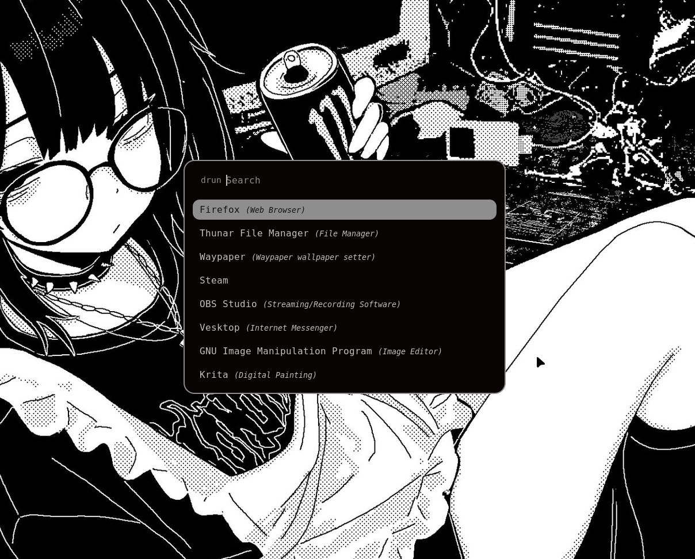
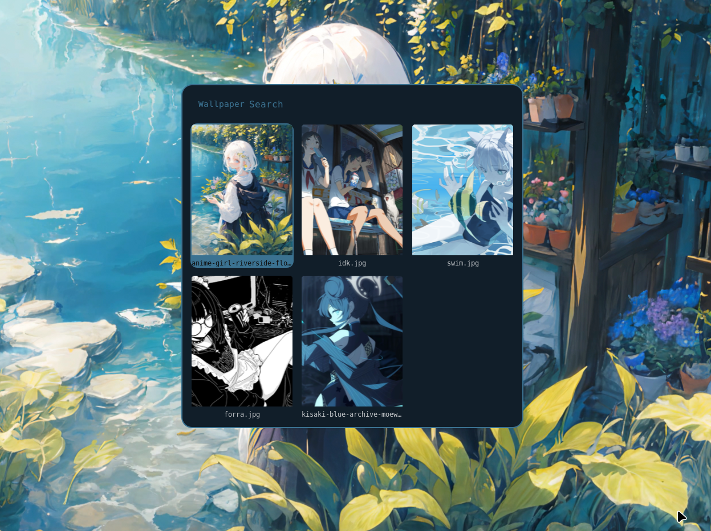

# niri-ch.dotfiles

Personal dotfiles for a [niri](https://github.com/YaLTeR/niri) setup: window manager
config, rofi theming (with a custom image/video wallpaper picker), foot terminal,
and pywal templates. It's pretty basic for now, check the notes below to get it
running on a fresh machine.

## Screenshots




## Dependencies

Install these first. Package names below are for NixOS (`environment.systemPackages`),
on Arch it's mostly the same names via `pacman`, on Debian-based distros some of
these (`awww`, `mpvpaper`) may need to be built from source or grabbed from a
third-party repo since they're not always packaged.

| Package | Used for |
|---|---|
| `niri` | window manager |
| `rofi` | app launcher + wallpaper picker UI |
| `foot` | terminal |
| `awww` | static image wallpapers (renamed from `swww`) |
| `mpvpaper` | video wallpapers |
| `pywal` | color palette generation from wallpaper |
| `imagemagick` | thumbnail generation (images) |
| `ffmpeg` | thumbnail generation (video frame extraction) |
| `socat` | hot-swapping video wallpapers without restarting mpvpaper |
| `wireplumber` | audio control (`wpctl`), used by volume keybinds |
| `playerctl` | media key bindings (play/pause/next/prev) |
| `brightnessctl` | screen + keyboard backlight keybinds (laptop only) |
| `bibata-cursors` | cursor theme referenced in `niri/config.kdl` |

## Repo structure

```
niri/    config.kdl              -> ~/.config/niri/config.kdl
foot/    foot.ini                -> ~/.config/foot/foot.ini
wal/     templates/               -> ~/.config/wal/templates/
rofi/    rofiConf.rasi           -> ~/.config/rofi/rofiConf.rasi
rofi/    wallpaperPicker.rasi    -> ~/.config/rofi/wallpaperPicker.rasi
scripts/ wallpaper-select.sh     -> ~/.local/bin/wallpaper-select.sh
scripts/ wallpaper-restore.sh    -> ~/.local/bin/wallpaper-restore.sh
```

## Installation

1. Clone this repo:

   ```bash
   git clone git@github.com:ch-script/niri-ch.dotfiles.git
   cd niri-ch.dotfiles
   ```

2. Copy each folder's contents to its matching location (see the structure
   table above). Example:

   ```bash
   mkdir -p ~/.config/niri ~/.config/foot ~/.config/wal ~/.config/rofi ~/.local/bin

   cp niri/config.kdl           ~/.config/niri/config.kdl
   cp foot/foot.ini             ~/.config/foot/foot.ini
   cp -r wal/templates          ~/.config/wal/
   cp rofi/rofiConf.rasi        ~/.config/rofi/
   cp rofi/wallpaperPicker.rasi ~/.config/rofi/
   cp scripts/wallpaper-select.sh  ~/.local/bin/
   cp scripts/wallpaper-restore.sh ~/.local/bin/
   ```

3. **Make the scripts executable**: this step is easy to forget and the
   scripts silently won't run without it:

   ```bash
   chmod +x ~/.local/bin/wallpaper-select.sh ~/.local/bin/wallpaper-restore.sh
   ```

4. Create the wallpapers folder and drop some images/videos in it (if it doesnt exist yet lol):

   ```bash
   mkdir -p ~/Pictures/Wallpapers
   ```

   Supported image formats: `jpg`, `jpeg`, `png`, `webp`, `bmp`, `gif`.
   Supported video formats: `mp4`, `webm`, `mkv`, `mov`, `avi`.

5. On NixOS, add the dependency list above to `environment.systemPackages`
   and run:

   ```bash
   sudo nixos-rebuild switch --flake ~/path/to/your/flake#hostname
   ```

   On other distros, install the equivalent packages with your package
   manager.

6. Reload niri (or just log out/in ez):

   ```bash
   niri msg action reload-config
   ```

## Keybinds worth knowing

- `Super+Space`, app launcher (rofi drun)
- `Super+W`, wallpaper picker (images + videos, grid view)
- `XF86MonBrightness{Up,Down}`, screen brightness (laptop)
- `XF86KbdBrightness{Up,Down}`, keyboard backlight (laptop, ThinkPad-specific)
- `XF86Audio{RaiseVolume,LowerVolume,Mute,MicMute}`, audio controls
- `XF86Audio{Play,Next,Prev}`, media player controls

Full keybind list lives in `niri/config.kdl`.

## Notes

- The wallpaper picker manages `awww-daemon` and `mpvpaper` itself (starting
  and stopping whichever one is needed depending on whether you pick an image
  or a video), so you don't need to spawn `awww-daemon` manually in niri's
  startup. `wallpaper-restore.sh` handles restoring the last wallpaper on
  boot instead.
- pywal colors are regenerated automatically on every wallpaper change,
  including videos, using the cached thumbnail frame.
